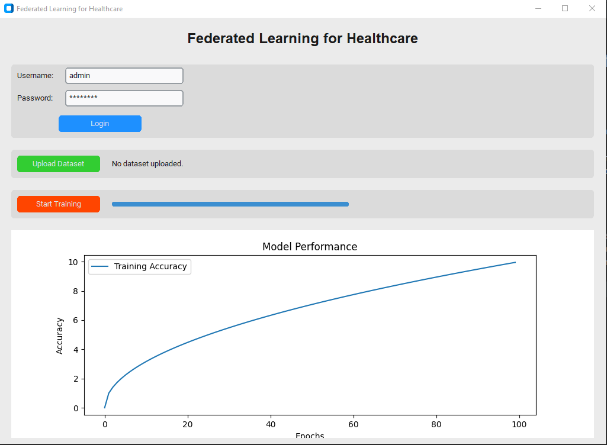

# Federated Learning for Healthcare

## Overview
This application implements a sophisticated user-friendly interface for Federated Learning in healthcare using privacy-preserving learning techniques. Built with `CustomTkinter`, the application provides features such as user authentication, dataset encryption, training progress visualization, and performance dashboards.

## Features
1. **User Authentication:** Secure login with username and password.
2. **Dataset Upload:** Secure encryption of datasets using AES-256 encryption.
3. **Training Progress:** Visual feedback with progress bars and real-time training updates.
4. **Performance Dashboard:** Real-time visualization of model performance during training.

## Prerequisites
Ensure you have Python 3.8+ installed. Install the required libraries before running the application.

## Installation

### Clone the Repository
```bash
$ git clone https://github.com/kayung-developer/Federated-Learning-App.git
$ cd federated-learning-ui
```

### Install Dependencies
Run the following command to install all required dependencies:
```bash
$ pip install -r requirements.txt
```

### Requirements
The following Python libraries are used in this project:

- `customtkinter`
- `tkinter`
- `cryptography`
- `matplotlib`

You can find these dependencies listed in the `requirements.txt` file.

```plaintext
customtkinter
matplotlib
cryptography
```

## Usage

### Start the Application
Run the following command to launch the application:
```bash
$ python app.py
```

### Application Workflow

1. **Login:** Enter the username and password to access the platform. (Default: `admin`/`password`)
2. **Upload Dataset:** Use the "Upload Dataset" button to select and encrypt a CSV dataset.
3. **Start Training:** Click "Start Training" to begin federated learning. The training progress is shown on a progress bar.
4. **View Dashboard:** Real-time updates of training accuracy are displayed on the dashboard.

## AES-256 Encryption Details
The application uses the `cryptography` library to encrypt datasets securely with AES-256. Encrypted files are saved with a `.enc` extension.

## Screenshots



## Video Demonstration
Here’s a demonstration of the application in action:


To view the video, make sure the file `model_training.mp4` is located in the `video` folder of the project directory.


## License
This project is licensed under the MIT License. See the LICENSE file for more details.

## Contributing
We welcome contributions! Please fork the repository and submit a pull request.

## Contact
For any issues or feature requests, feel free to reach out:
- **Email:** princelillwitty@gmail.com
- **GitHub:** [LinkedIn](https://linkedin.com/in/kayung-developer)
